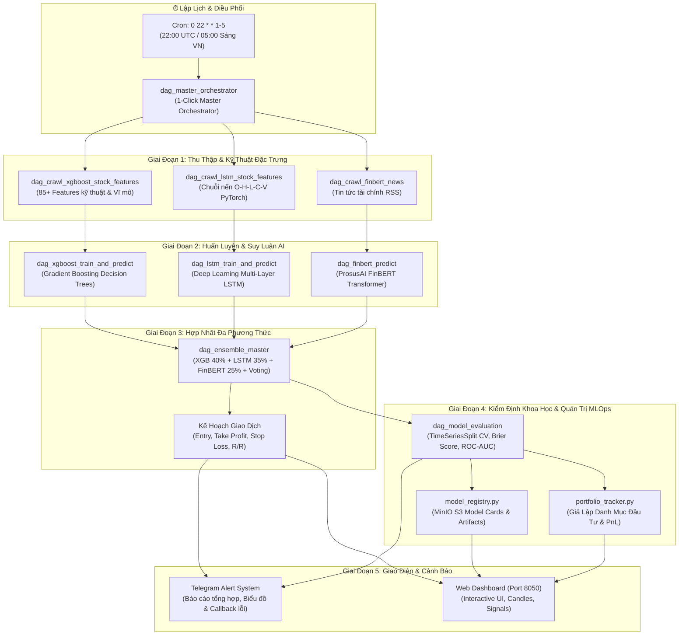

# 🚀 Quantum Multi-Modal Stock Forecasting & MLOps Platform

Hệ thống Định lượng & Dự báo Chứng khoán Đa Phương thức kết hợp Trí Tuệ Nhân Tạo (AI) và MLOps hoàn chỉnh trên nền tảng **Apache Airflow**, **MinIO S3**, **PostgreSQL** và **Docker Compose**.

Hệ thống phân tích tự động **20 mã cổ phiếu Blue-chip hàng đầu của Mỹ (S&P 500)** qua 3 nhánh độc lập: **Học máy GBDT (XGBoost)**, **Mạng nơ-ron chuỗi thời gian (PyTorch LSTM)**, và **Mô hình ngôn ngữ tài chính (FinBERT NLP)**, trước khi tổng hợp bằng **Master Ensemble 4 phương pháp** để đưa ra khuyến nghị giao dịch và kế hoạch quản trị rủi ro chi tiết.

---

## 🏗️ Kiến Trúc Hệ Thống (Architecture)



---

## 📊 Danh Mục 20 Mã Cổ Phiếu Theo Nhóm Ngành (GICS Standard)

| # | Mã (Ticker) | Tên Doanh Nghiệp | Nhóm Ngành (GICS) |
|---|---|---|---|
| 1 | **AAPL** | Apple Inc. | Công nghệ (Technology) |
| 2 | **MSFT** | Microsoft Corp. | Công nghệ (Technology) |
| 3 | **NVDA** | NVIDIA Corp. | Công nghệ (Technology) |
| 4 | **GOOGL** | Alphabet Inc. | Công nghệ (Technology) |
| 5 | **AMZN** | Amazon.com Inc. | Tiêu dùng không thiết yếu (Consumer Discretionary) |
| 6 | **MCD** | McDonald's Corp. | Tiêu dùng không thiết yếu (Consumer Discretionary) |
| 7 | **NKE** | Nike Inc. | Tiêu dùng không thiết yếu (Consumer Discretionary) |
| 8 | **WMT** | Walmart Inc. | Tiêu dùng thiết yếu (Consumer Staples) |
| 9 | **PG** | Procter & Gamble Co. | Tiêu dùng thiết yếu (Consumer Staples) |
| 10 | **KO** | Coca-Cola Co. | Tiêu dùng thiết yếu (Consumer Staples) |
| 11 | **JPM** | JPMorgan Chase & Co. | Tài chính - Ngân hàng (Financials) |
| 12 | **V** | Visa Inc. | Dịch vụ Tài chính (Financials) |
| 13 | **UNH** | UnitedHealth Group | Y tế & Bảo hiểm (Healthcare) |
| 14 | **JNJ** | Johnson & Johnson | Y tế & Dược phẩm (Healthcare) |
| 15 | **CAT** | Caterpillar Inc. | Công nghiệp Chế tạo (Industrials) |
| 16 | **BA** | Boeing Co. | Hàng không & Quốc phòng (Industrials) |
| 17 | **XOM** | Exxon Mobil Corp. | Năng lượng & Dầu khí (Energy) |
| 18 | **CVX** | Chevron Corp. | Năng lượng & Dầu khí (Energy) |
| 19 | **NEE** | NextEra Energy Inc. | Năng lượng & Tiện ích (Utilities) |
| 20 | **LIN** | Linde plc | Vật liệu Công nghiệp (Materials) |

---

## ⚡ Các Cổng Dịch Vụ & Tài Khoản Mặc Định

| Dịch vụ | Cổng (Port) | Địa chỉ URL | Tài khoản mặc định |
|---|---|---|---|
| **Airflow Web UI** | `8080` | http://localhost:8080 | `admin` / `admin` |
| **Interactive Dashboard** | `8050` | http://localhost:8050 | *(Truy cập trực tiếp không cần mật khẩu)* |
| **MinIO Web Console** | `9001` | http://localhost:9001 | `minioadmin` / `minioadmin` |
| **MinIO S3 API** | `9000` | http://localhost:9000 | `minioadmin` / `minioadmin` |
| **PostgreSQL** | `5432` | `localhost:5432` | `airflow` / `airflow` (db: `airflow`) |

---

## ⏰ Lập Lịch Vận Hành Tự Động (Automated Cron Schedule)

Hệ thống được thiết lập lịch chạy tự động trên [dag_master_orchestrator.py](file:///home/lvh/airflow-minio/dags/dag_master_orchestrator.py):

> **`0 22 * * 1-5`** *(22:00 UTC, từ Thứ Hai đến Thứ Sáu)*
> - **Giờ Việt Nam tương ứng:** **05:00 sáng** *(từ Thứ Ba đến Thứ Bảy)*.
> - **Lý do lựa chọn:**
>   1. Phiên chứng khoán Mỹ (NYSE/NASDAQ) đóng cửa lúc 16:00 EST/EDT (khoảng 03:00 - 04:00 sáng giờ VN).
>   2. Chờ 60-90 phút để dữ liệu nến ngày (`Close`, `Volume`, Technical Indicators) chốt sổ hoàn tất và cập nhật chính xác trên Yahoo Finance.
>   3. Pipeline thực thi trong 15-20 phút. Đến **06:00 - 07:00 sáng**, khi bạn thức dậy, Bot Telegram đã gửi đầy đủ báo cáo tổng hợp và kế hoạch giao dịch cho ngày mới.

---

## 🚀 Hướng Dẫn Khởi Chạy Nhanh (Quick Start)

### 1. Cấu hình biến môi trường (`.env`)
Tạo hoặc chỉnh sửa file `.env` tại thư mục gốc:
```bash
AIRFLOW_UID=50000
TELEGRAM_TOKEN=8803904442:AAH4Y-GS0J3ffhAxg5CRdv1avz9Lr7b5Svg
TELEGRAM_CHAT_ID=7660617934
```

### 2. Khởi chạy toàn bộ hệ thống bằng Docker Compose
```bash
# Khởi chạy ngầm 5 dịch vụ (Postgres, MinIO, Scheduler, Webserver, Dashboard)
docker compose up -d

# Kiểm tra trạng thái containers
docker compose ps
```

### 3. Kích hoạt thủ công chuỗi dự báo (1-Click Run)
- Truy cập Airflow Web UI tại: http://localhost:8080
- Đăng nhập với tài khoản `admin` / `admin`
- Tìm DAG `dag_master_orchestrator` và nhấn nút **▶ Trigger DAG**.

---

## 📁 Cấu Trúc Thư Mục Dự Án

```
airflow-minio/
├── .env                              # Biến môi trường Airflow UID, Telegram Bot
├── .gitignore                        # Cấu hình bỏ qua logs, cache, minio_data
├── Dockerfile                        # Image Airflow mở rộng (yfinance, torch, transformers, boto3)
├── docker-compose.yaml               # Cấu hình 5 microservices Docker
├── requirements.txt                  # Danh mục dependencies Python
├── README.md                         # Tài liệu hướng dẫn dự án
├── dags/                             # 16 Modules DAGs & Utilities
│   ├── config_shared.py              # Cấu hình tập trung: SECTOR_MAP, TICKERS_META, CRON
│   ├── alert_utils.py                # Tiện ích Telegram callback & send_telegram_safe retry
│   ├── chart_utils.py                # Sinh biểu đồ phân tích kỹ thuật nến và chỉ báo
│   ├── data_validator.py             # Quality Gate: Kiểm tra Data Drift, Outliers, Missing
│   ├── model_registry.py             # Đóng gói Model Artifacts & sinh Model Cards MinIO
│   ├── model_evaluator.py            # Backtest TimeSeriesSplit CV, ROC-AUC, Brier Score
│   ├── portfolio_tracker.py          # Quản trị danh mục đầu tư ảo và PnL
│   ├── dag_crawl_xgboost_stock_features.py   # Cào 85+ kỹ thuật cho GBDT
│   ├── dag_crawl_lstm_stock_features.py      # Cào chuỗi thời gian nến cho PyTorch
│   ├── dag_crawl_finbert_news.py             # Cào tin tức tài chính Google News RSS
│   ├── dag_xgboost_train_and_predict.py      # Huấn luyện & dự báo XGBoost
│   ├── dag_lstm_train_and_predict.py         # Huấn luyện & dự báo PyTorch LSTM
│   ├── dag_finbert_predict.py                # Phân tích sắc thái tài chính FinBERT
│   ├── dag_ensemble_master.py                # Master Ensemble 4 phương pháp & Trading Plan
│   ├── dag_model_evaluation.py               # Kiểm định mô hình khoa học
│   └── dag_master_orchestrator.py            # Master Orchestrator 1-Click Run & Cron
├── dashboard/                        # Quantum Web Dashboard (Cổng 8050)
│   ├── app.py                        # HTTP Backend tích hợp MinIO S3 API
│   └── static/                       # Frontend HTML, CSS, JavaScript thuần (Responsive)
├── minio_data/                       # Lưu trữ đĩa MinIO S3
│   └── stock-xgboost-data/           # Dữ liệu chứng khoán, models, evaluation, portfolio
└── logs/                             # Nhật ký vận hành Airflow
```

---

## 🗄️ Cấu Trúc Bucket Lưu Trữ MinIO (`stock-xgboost-data`)

- `raw-data/`: Dữ liệu giá lịch sử thô và tin tức RSS crawl hàng ngày.
- `xgboost/`: Features 85+ chỉ báo kỹ thuật và dự báo xác suất của XGBoost.
- `lstm/`: Tensor chuỗi nến và dự báo xu hướng của PyTorch LSTM.
- `finbert/`: Điểm số sắc thái cảm xúc tin tức tài chính của FinBERT.
- `ensemble/`: Bảng tổng hợp Master Ensemble 4 phương pháp và file ZIP biểu đồ kỹ thuật.
- `models/`: Model Artifacts (`.json`, `.pt`), Scalers (`.joblib`), và Model Cards MLOps.
- `quality/`: Báo cáo Data Quality Gate và kiểm toán chất lượng dữ liệu.
- `evaluation/`: Báo cáo kiểm định khoa học (Backtesting TimeSeriesSplit, Correlation CSV).
- `portfolio/`: Nhật ký giao dịch danh mục đầu tư ảo và thống kê PnL.

---

## 🛡️ Kiểm Tra Tính Toàn Vẹn Hệ Thống (Verification)

Kiểm tra cú pháp toàn bộ hệ thống Python:
```bash
python3 -m py_compile dags/*.py dashboard/app.py
```

Kiểm tra tính hợp lệ của cấu hình Docker:
```bash
docker compose config
```
