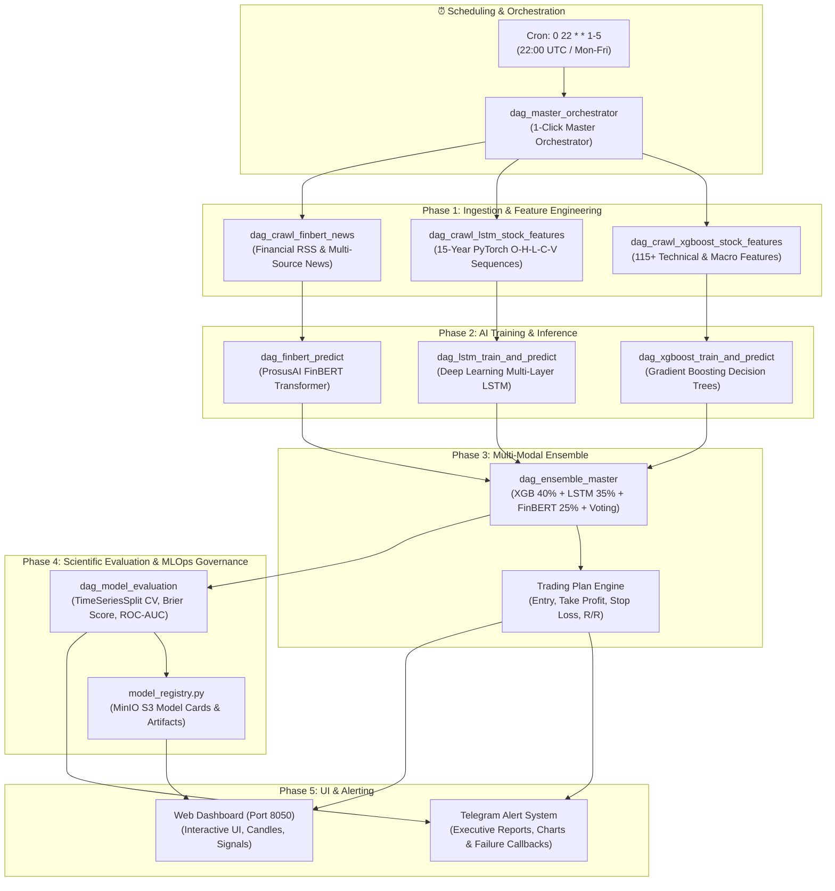

# 🚀 Quantum Multi-Modal Stock Forecasting & MLOps Platform

[](https://github.com/lehoang0702/airflow-stock/actions/workflows/ci.yml)
[](https://airflow.apache.org/)
[](https://min.io/)
[](https://optuna.org/)
[](https://www.python.org/)

An end-to-end Quantitative Multi-Modal Stock Forecasting and MLOps Platform built on **Apache Airflow**, **MinIO S3**, **PostgreSQL**, and **Docker Compose**.

The platform automatically analyzes **20 leading US Blue-chip stocks (S&P 500)** across 3 independent pipelines: **GBDT Machine Learning (XGBoost)**, **Deep Learning Time-Series (PyTorch LSTM)**, and **Financial Language Modeling (FinBERT NLP)**, before synthesizing signals via a **4-Method Master Ensemble** to deliver high-conviction trading recommendations and actionable risk-management plans.

---

## 🏗️ System Architecture



---

## 📊 20 Blue-Chip Stock Universe by Sector (GICS Standard)

| # | Ticker | Company Name | GICS Sector |
|---|---|---|---|
| 1 | **AAPL** | Apple Inc. | Information Technology |
| 2 | **MSFT** | Microsoft Corp. | Information Technology |
| 3 | **NVDA** | NVIDIA Corp. | Information Technology |
| 4 | **GOOGL** | Alphabet Inc. | Communication Services / Technology |
| 5 | **AMZN** | Amazon.com Inc. | Consumer Discretionary |
| 6 | **MCD** | McDonald's Corp. | Consumer Discretionary |
| 7 | **NKE** | Nike Inc. | Consumer Discretionary |
| 8 | **WMT** | Walmart Inc. | Consumer Staples |
| 9 | **PG** | Procter & Gamble Co. | Consumer Staples |
| 10 | **KO** | Coca-Cola Co. | Consumer Staples |
| 11 | **JPM** | JPMorgan Chase & Co. | Financials |
| 12 | **V** | Visa Inc. | Financials |
| 13 | **UNH** | UnitedHealth Group | Healthcare |
| 14 | **JNJ** | Johnson & Johnson | Healthcare |
| 15 | **CAT** | Caterpillar Inc. | Industrials |
| 16 | **BA** | Boeing Co. | Industrials (Aerospace & Defense) |
| 17 | **XOM** | Exxon Mobil Corp. | Energy |
| 18 | **CVX** | Chevron Corp. | Energy |
| 19 | **NEE** | NextEra Energy Inc. | Utilities |
| 20 | **LIN** | Linde plc | Materials |

---

## ⚡ Service Ports & Default Credentials

| Service | Port | URL | Default Credentials |
|---|---|---|---|
| **Airflow Web UI** | `8080` | http://localhost:8080 | `admin` / `admin` |
| **Interactive Dashboard** | `8050` | http://localhost:8050 | *(Public access, no authentication required)* |
| **MLflow Tracking UI** | `5000` | http://localhost:5000 | *(Public access, no authentication required)* |
| **MinIO Web Console** | `9001` | http://localhost:9001 | `minioadmin` / `minioadmin` |
| **MinIO S3 API** | `9000` | http://localhost:9000 | `minioadmin` / `minioadmin` |
| **PostgreSQL** | `5432` | `localhost:5432` | `airflow` / `airflow` (db: `airflow`) |

---

## ⏰ Automated Cron Schedule

The pipeline is automated via [dag_master_orchestrator.py](dags/dag_master_orchestrator.py):

> **`0 22 * * 1-5`** *(22:00 UTC, Monday through Friday)*
> - **Market Close Alignment:** US markets (NYSE / NASDAQ) close at 16:00 EST/EDT (20:00 / 21:00 UTC).
> - **Execution Timing Rationale:**
>   1. Provides a 60–90 minute settlement buffer after market close to ensure daily OHLCV, volume metrics, and corporate action data are fully finalized across data feeds.
>   2. Pipeline executes in approximately 15–20 minutes.
>   3. Automated Telegram briefings, model performance cards, and trading plans are dispatched ahead of European/Asian market opens and hours before US pre-market trading.

---

## 🚀 Quick Start Guide

### 1. Environment Configuration (`.env`)
Create or edit the `.env` file in the project root:
```bash
AIRFLOW_UID=50000
TELEGRAM_TOKEN=your_telegram_bot_token
TELEGRAM_CHAT_ID=your_chat_id
```

### 2. Launch All Microservices with Docker Compose
```bash
# Start all 5 services in detached mode (Postgres, MinIO, Scheduler, Webserver, Dashboard)
docker compose up -d

# Check container status
docker compose ps
```

### 3. Trigger Forecasting Pipeline Manually (1-Click Run)
- Navigate to the Airflow Web UI: http://localhost:8080
- Log in with credentials `admin` / `admin`
- Locate the DAG named `dag_master_orchestrator` and click **▶ Trigger DAG**.

---

## 📁 Project Directory Structure

```
airflow-stock/
├── .env                              # Environment variables (Airflow UID, Telegram Bot credentials)
├── .gitignore                        # Git ignore rules (logs, cache, minio_data)
├── Dockerfile                        # Extended Airflow image (yfinance, torch, transformers, boto3)
├── docker-compose.yaml               # Docker Compose configuration (5 microservices)
├── requirements.txt                  # Python dependencies manifest
├── README.md                         # Project documentation
├── create_executive_pdf.py           # Script sinh báo cáo PDF tự động cho Ban Điều Hành
├── dags/                             # 16 DAG Modules & Shared Utilities
│   ├── config_shared.py              # Centralized configuration: SECTOR_MAP, TICKERS_META, MACRO, CRON
│   ├── alert_utils.py                # Telegram alerts, on-failure callbacks & safe retry logic
│   ├── chart_utils.py                # Technical candlestick & indicator charting generation
│   ├── data_validator.py             # Quality Gate: Data drift detection, outlier filtering, null checks
│   ├── hyperparameter_tuner.py       # 🧠 AutoML: Optuna Bayesian Optimization for hyperparameter tuning
│   ├── model_registry.py             # Model artifact packaging & S3 Model Cards generation
│   ├── model_evaluator.py            # Scientific backtesting: TimeSeriesSplit CV, ROC-AUC, Brier Score
│   ├── dag_crawl_xgboost_stock_features.py   # Ingestion for 115+ technical, macro & fundamental features
│   ├── dag_crawl_lstm_stock_features.py      # Ingestion for 15-year OHLCV time-series for PyTorch
│   ├── dag_crawl_finbert_news.py             # Ingestion for multi-source financial RSS news & summaries
│   ├── dag_xgboost_train_and_predict.py      # XGBoost model training, tuning & probability inference
│   ├── dag_lstm_train_and_predict.py         # PyTorch LSTM deep learning training & sequence inference
│   ├── dag_finbert_predict.py                # FinBERT sentiment analysis & NLP signal scoring
│   ├── dag_ensemble_master.py                # 4-method Master Ensemble & Trading Plan generation
│   ├── dag_model_evaluation.py               # Scientific evaluation & cross-validation pipeline
│   └── dag_master_orchestrator.py            # Master Orchestrator (1-Click run & automated cron)
├── dashboard/                        # Quantum Web Dashboard (Port 8050)
│   ├── app.py                        # Python HTTP backend with MinIO S3 API integration
│   └── static/                       # Responsive vanilla frontend (HTML5, CSS3, JavaScript)
├── minio_data/                       # Local volume mount for MinIO S3 storage
│   └── stock-data/           # Market datasets, model registry, evaluations
└── logs/                             # Apache Airflow task execution logs
```

---

## 🗄️ MinIO S3 Storage Structure (`stock-data`)

- `raw-data/`: Raw historical market quotes and daily ingested RSS news articles.
- `xgboost/`: 115+ engineered technical, intermarket, and fundamental valuation features (`.parquet` & `.csv`).
- `lstm/`: 15-year normalized sequence tensors and PyTorch LSTM trend predictions (`.parquet` & `.csv`).
- `finbert/`: ProsusAI FinBERT sentiment polarity scores and categorized financial summaries (`.parquet` & `.csv`).
- `ensemble/`: 4-method Master Ensemble decision matrix and technical analysis charts (ZIP package).
- `models/`: Exported model artifacts (`.json`, `.pt`), scalers (`.joblib`), and MLOps Model Cards.
- `quality/`: Automated Data Quality Gate audit logs, drift metrics, and validation reports.
- `evaluation/`: Scientific backtesting reports, TimeSeriesSplit CV metrics, and correlation matrices.

---

## 🛡️ System Integrity & Verification

Verify syntax across all Python DAGs, utilities, and dashboard backend:
```bash
python3 -m py_compile dags/*.py dashboard/app.py
```

Validate Docker Compose service definitions:
```bash
docker compose config
```
