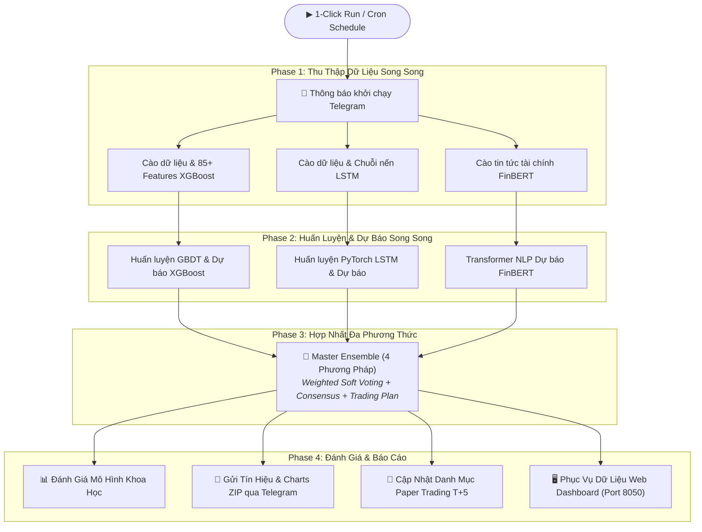

<style>
  body, .vscode-body, .markdown-body {
    max-width: 960px !important;
    margin: 0 auto !important;
    padding: 35px 25px !important;
    font-family: -apple-system, BlinkMacSystemFont, "Segoe UI", Roboto, "Helvetica Neue", Arial, sans-serif;
    line-height: 1.65;
  }
  table {
    margin-left: auto !important;
    margin-right: auto !important;
    border-collapse: collapse;
    width: 100%;
    max-width: 920px;
  }
  th, td {
    padding: 8px 12px !important;
  }
  .mermaid {
    display: flex;
    justify-content: center;
    margin: 20px 0;
  }
  hr {
    margin: 2.5rem 0;
  }
</style>

<div align="center">

# 📊 BÁO CÁO DỰ ÁN
# HỆ THỐNG DỰ BÁO CỔ PHIẾU ĐA PHƯƠNG THỨC

> **Hệ thống định lượng tự động (Quantitative Pipeline) dự báo xu hướng giá cổ phiếu S&P 500**  
> **XGBoost (Tabular) · LSTM (Deep Learning) · FinBERT (NLP)**

<p align="center">
  
  
  
  
  
  
  
</p>

<p align="center">
  <b>Nhóm phát triển:</b> <code>Nhóm 63</code> &nbsp;|&nbsp; 
  <b>Trạng thái:</b> <code>Production</code> &nbsp;|&nbsp; 
  <b>Ngày cập nhật:</b> <code>10/09/2026</code>
</p>

---

</div>


## 📋 Mục Lục

1. [Tổng Quan Dự Án](#1-tổng-quan-dự-án)
2. [Kiến Trúc Hệ Thống](#2-kiến-trúc-hệ-thống)
3. [Công Nghệ Sử Dụng](#3-công-nghệ-sử-dụng)
4. [Cấu Trúc Thư Mục Dự Án](#4-cấu-trúc-thư-mục-dự-án)
5. [Pipeline Machine Learning](#5-pipeline-machine-learning)
6. [Chi Tiết Các DAG (Airflow)](#6-chi-tiết-các-dag-airflow)
7. [Hệ Thống Module Hỗ Trợ](#7-hệ-thống-module-hỗ-trợ)
8. [Cơ Chế Ensemble Đa Phương Thức](#8-cơ-chế-ensemble-đa-phương-thức)
9. [Dashboard Giám Sát](#9-dashboard-giám-sát)
10. [Hạ Tầng Triển Khai (Docker)](#10-hạ-tầng-triển-khai-docker)
11. [Dữ Liệu & Lưu Trữ MinIO](#11-dữ-liệu--lưu-trữ-minio)
12. [Lịch Vận Hành Tự Động](#12-lịch-vận-hành-tự-động)
13. [Hướng Phát Triển](#13-hướng-phát-triển)

---

## 1. Tổng Quan Dự Án

### 1.1. Mục Tiêu

Xây dựng một hệ thống **pipeline Machine Learning tự động hóa end-to-end**, có khả năng:

- **Thu thập dữ liệu** lịch sử giá cổ phiếu, chỉ báo kỹ thuật, và tin tức tài chính
- **Huấn luyện & dự báo** xu hướng giá T+5 (5 phiên giao dịch tiếp theo) bằng 3 mô hình AI
- **Hợp nhất kết quả** từ 3 mô hình thành 1 tín hiệu giao dịch thống nhất (Ensemble)
- **Cảnh báo tự động** qua Telegram Bot với kế hoạch giao dịch chi tiết
- **Mô phỏng danh mục đầu tư** (Paper Trading) để kiểm chứng hiệu quả chiến lược

### 1.2. Phạm Vi Dữ Liệu

| Tiêu Chí | Chi Tiết |
|---|---|
| **Số mã cổ phiếu** | 20 mã Blue-chip thuộc S&P 500 |
| **Nhóm ngành (GICS)** | 9 nhóm: Technology, Consumer Discretionary, Consumer Staples, Financials, Healthcare, Industrials, Energy, Utilities, Materials |
| **Dữ liệu lịch sử** | 5 – 10 năm (tùy model) |
| **Chỉ số vĩ mô** | SPY, QQQ, ^VIX, ^TNX |
| **Nguồn tin tức** | RSS/API tin tức tài chính tiếng Anh |

### 1.3. Danh Sách 20 Mã Cổ Phiếu Theo Dõi

| # | Mã | Tên Công Ty | Ngành |
|---|---|---|---|
| 1 | AAPL | Apple Inc. | Công nghệ |
| 2 | MSFT | Microsoft Corp. | Công nghệ |
| 3 | NVDA | NVIDIA Corp. | Công nghệ |
| 4 | GOOGL | Alphabet Inc. | Công nghệ |
| 5 | AMZN | Amazon.com Inc. | Hàng tiêu dùng không thiết yếu |
| 6 | MCD | McDonald's Corp. | Dịch vụ Ăn uống |
| 7 | NKE | Nike Inc. | Thời trang & Thể thao |
| 8 | WMT | Walmart Inc. | Bán lẻ & Tiêu dùng |
| 9 | PG | Procter & Gamble Co. | Hàng tiêu dùng thiết yếu |
| 10 | KO | Coca-Cola Co. | Đồ uống & Hàng tiêu dùng |
| 11 | JPM | JPMorgan Chase & Co. | Tài chính - Ngân hàng |
| 12 | V | Visa Inc. | Dịch vụ Tài chính |
| 13 | UNH | UnitedHealth Group | Bảo hiểm Y tế |
| 14 | JNJ | Johnson & Johnson | Y tế & Chăm sóc sức khỏe |
| 15 | CAT | Caterpillar Inc. | Công nghiệp Chế tạo |
| 16 | BA | Boeing Co. | Hàng không & Quốc phòng |
| 17 | XOM | Exxon Mobil Corp. | Năng lượng & Dầu khí |
| 18 | CVX | Chevron Corp. | Năng lượng & Dầu khí |
| 19 | NEE | NextEra Energy Inc. | Năng lượng & Tiện ích |
| 20 | LIN | Linde plc | Vật liệu Công nghiệp |

---

## 2. Kiến Trúc Hệ Thống

### 2.1. Sơ Đồ Kiến Trúc Tổng Thể



```
┌─────────────────────────────────────────────────────────────────────────┐
│                     MASTER ORCHESTRATOR (1-Click Run)                   │
│                        dag_master_orchestrator                          │
├─────────────────────────────────────────────────────────────────────────┤
│                                                                         │
│   ┌─────── Phase 1: Thu Thập Dữ Liệu (Song Song) ───────┐             │
│   │                                                       │             │
│   │  ┌──────────────┐ ┌──────────────┐ ┌──────────────┐  │             │
│   │  │  Crawl Data  │ │  Crawl Data  │ │  Crawl News  │  │             │
│   │  │   XGBoost    │ │    LSTM      │ │   FinBERT    │  │             │
│   │  │ (85+ feat.)  │ │ (OHLCV seq.) │ │ (RSS/API)    │  │             │
│   │  └──────┬───────┘ └──────┬───────┘ └──────┬───────┘  │             │
│   └─────────┼────────────────┼────────────────┼──────────┘             │
│             ▼                ▼                ▼                          │
│   ┌─────── Phase 2: Huấn Luyện & Dự Báo (Song Song) ────┐             │
│   │                                                       │             │
│   │  ┌──────────────┐ ┌──────────────┐ ┌──────────────┐  │             │
│   │  │   XGBoost    │ │  PyTorch     │ │  FinBERT     │  │             │
│   │  │   GBDT       │ │  Stacked     │ │  Transformer │  │             │
│   │  │  Classifier  │ │    LSTM      │ │  NLP Model   │  │             │
│   │  └──────┬───────┘ └──────┬───────┘ └──────┬───────┘  │             │
│   └─────────┼────────────────┼────────────────┼──────────┘             │
│             └────────────────┼────────────────┘                         │
│                              ▼                                          │
│   ┌─────── Phase 3: Ensemble Đa Phương Thức ────────────┐              │
│   │                                                       │             │
│   │   Weighted Soft Voting + Consensus + Trading Plan     │             │
│   │   P_ens = 0.40×XGB + 0.35×LSTM + 0.25×FinBERT       │             │
│   │                                                       │             │
│   └───────────────────────┬───────────────────────────────┘             │
│                           ▼                                             │
│   ┌─────── Phase 4: Đánh Giá & Báo Cáo ─────────────────┐             │
│   │                                                       │             │
│   │   Model Evaluation · TimeSeriesSplit CV · Reports     │             │
│   │   Telegram Alert · Paper Trading · Dashboard          │             │
│   │                                                       │             │
│   └───────────────────────────────────────────────────────┘             │
│                                                                         │
├─────────────────────────────────────────────────────────────────────────┤
│  📦 MinIO (S3)  │  🐘 PostgreSQL  │  📊 Dashboard (8050)  │ 📱 Telegram │
└─────────────────────────────────────────────────────────────────────────┘
```

### 2.2. Luồng Dữ Liệu

```
Yahoo Finance API ──► Airflow DAGs ──► Feature Engineering ──► MinIO (S3)
                                                                  │
RSS/News APIs ──────► Airflow DAGs ──► NLP Processing ───────────►│
                                                                  │
                                                        ┌─────────┘
                                                        ▼
                                               Model Training
                                               (XGBoost/LSTM/FinBERT)
                                                        │
                                                        ▼
                                               Ensemble Prediction
                                                        │
                                            ┌───────────┼───────────┐
                                            ▼           ▼           ▼
                                       Telegram     Dashboard    MinIO
                                        Alert       Web UI      Storage
```

---

## 3. Công Nghệ Sử Dụng

### 3.1. Hạ Tầng & DevOps

| Công Nghệ | Phiên Bản | Vai Trò |
|---|---|---|
| **Docker & Docker Compose** | Latest | Container hóa toàn bộ hệ thống |
| **Apache Airflow** | 2.8.1 | Điều phối pipeline, lập lịch, giám sát |
| **PostgreSQL** | 13 | Database metadata cho Airflow |
| **MinIO** | Latest | Object Storage tương thích S3 |
| **Python** | 3.11 | Ngôn ngữ chính |

### 3.2. Machine Learning & AI

| Thư Viện | Vai Trò |
|---|---|
| **XGBoost** | Mô hình Gradient Boosted Decision Trees |
| **PyTorch** | Framework Deep Learning cho LSTM (CPU mode) |
| **Transformers (HuggingFace)** | Chạy mô hình FinBERT NLP |
| **Scikit-learn** | Preprocessing, metrics, cross-validation |
| **NumPy / Pandas** | Xử lý dữ liệu và tính toán |

### 3.3. Dữ Liệu & Giao Tiếp

| Thư Viện | Vai Trò |
|---|---|
| **yfinance** | Kéo dữ liệu lịch sử giá cổ phiếu từ Yahoo Finance |
| **boto3** | Tương tác với MinIO qua S3 API |
| **requests** | Gọi API Telegram, RSS feeds |
| **Matplotlib** | Vẽ biểu đồ dự báo giá |
| **PyArrow / FastParquet** | Đọc/ghi file Parquet hiệu năng cao |

---

## 4. Cấu Trúc Thư Mục Dự Án

```
airflow-minio/
├── docker-compose.yaml          # Định nghĩa 6 services Docker
├── Dockerfile                   # Custom Airflow image + ML libraries
├── requirements.txt             # Python dependencies
├── .env                         # Biến môi trường (Airflow UID, tokens)
├── .gitignore
│
├── dags/                        # ⭐ Thư mục chứa toàn bộ DAGs & modules
│   ├── config_shared.py         #    Cấu hình dùng chung (20 mã, GICS, cron)
│   ├── dag_master_orchestrator.py  # 👑 Orchestrator 1-Click Run
│   ├── dag_crawl_xgboost_stock_features.py  # Cào & Feature Engineering XGBoost
│   ├── dag_crawl_lstm_stock_features.py     # Cào & Chuỗi nến LSTM
│   ├── dag_crawl_finbert_news.py            # Cào tin tức cho FinBERT
│   ├── dag_xgboost_train_and_predict.py     # Huấn luyện & Dự báo XGBoost
│   ├── dag_lstm_train_and_predict.py        # Huấn luyện & Dự báo LSTM
│   ├── dag_finbert_predict.py               # Dự báo Sentiment FinBERT
│   ├── dag_ensemble_master.py               # Hợp nhất 4 Phương Pháp
│   ├── dag_model_evaluation.py              # Đánh giá mô hình khoa học
│   ├── alert_utils.py           #    Hệ thống cảnh báo Telegram
│   ├── chart_utils.py           #    Vẽ biểu đồ dự báo
│   ├── data_validator.py        #    Kiểm định chất lượng dữ liệu (MLOps)
│   ├── model_registry.py        #    Quản lý phiên bản mô hình
│   ├── model_evaluator.py       #    Đánh giá metrics mô hình
│   └── portfolio_tracker.py     #    Paper Trading T+5 Engine
│
├── dashboard/                   # 📊 Web Dashboard tương tác
│   ├── app.py                   #    Backend Python HTTP Server (port 8050)
│   └── static/
│       └── index.html           #    Frontend HTML/CSS/JS
│
├── minio_data/                  # 💾 Dữ liệu MinIO persistent
│   └── stock-xgboost-data/
│       ├── xgboost/             #    Dataset & dự báo XGBoost
│       ├── lstm/                #    Dataset & dự báo LSTM
│       ├── finbert/             #    Tin tức & dự báo FinBERT
│       ├── ensemble/            #    Kết quả hợp nhất 4 phương pháp
│       ├── comparison/          #    Bảng đối chiếu 4 mô hình
│       ├── models/              #    Model Registry (artifacts, cards)
│       ├── evaluation/          #    Kết quả đánh giá mô hình
│       ├── portfolio/           #    Trạng thái Paper Trading
│       └── quality/             #    Báo cáo kiểm định chất lượng
│
├── logs/                        # 📝 Airflow task logs
└── plugins/                     # 🔌 Airflow plugins (mở rộng)
```

---

## 5. Pipeline Machine Learning

### 5.1. Phương Pháp 1 — XGBoost (Tabular Classification)

**Mục tiêu:** Phân loại nhị phân — giá cổ phiếu sẽ tăng hay giảm trong T+5 phiên.

**Đặc trưng đầu vào (85+ features):**

| Nhóm Chỉ Báo | Chi Tiết |
|---|---|
| **Xu hướng (Trend)** | SMA (5, 10, 20, 50, 200), EMA (9, 21), Golden/Death Cross, MACD & Signal |
| **Động lượng (Momentum)** | RSI (14 ngày), Stochastic Oscillator (%K, %D), ROC |
| **Biến động (Volatility)** | Bollinger Bands (Upper, Lower, Width, %B), ATR |
| **Khối lượng (Volume)** | Volume MA 20, Volume Ratio, OBV |
| **Kinh tế vĩ mô (Macro)** | Lợi suất TPCP 10Y (^TNX), VIX, Tương quan SPY & QQQ |

**Phân chia dữ liệu (Time-Based Split):**
- **Train:** Trước 2023-01-01
- **Validation:** 2023-01-01 → 2024-01-01
- **Test:** Từ 2024-01-01 trở đi

### 5.2. Phương Pháp 2 — LSTM (Deep Learning Time-Series)

**Mục tiêu:** Khai thác quy luật chuỗi thời gian nến và động lượng giá.

| Thông Số | Giá Trị |
|---|---|
| **Kiến trúc** | Stacked LSTM (PyTorch) |
| **Dữ liệu vào** | Chuỗi nến OHLCV + chỉ báo kỹ thuật |
| **Lookback window** | ≥ 30 phiên |
| **Framework** | PyTorch CPU (tối ưu cho Docker) |
| **Preprocessing** | StandardScaler |
| **Xác suất hiệu chỉnh** | 44% – 62% (chuẩn thực tế) |

### 5.3. Phương Pháp 3 — FinBERT (NLP Sentiment Analysis)

**Mục tiêu:** Nắm bắt tâm lý thị trường qua tin tức tài chính.

| Thông Số | Giá Trị |
|---|---|
| **Mô hình** | `ProsusAI/finbert` (HuggingFace) |
| **Kiến trúc** | BERT Transformer cho Financial Sentiment |
| **Đầu vào** | Tiêu đề tin tức tài chính mỗi ngày |
| **Đầu ra** | 3 classes: Positive / Negative / Neutral |
| **Tokenizer** | AutoTokenizer, max_length=128, truncation=True |
| **Score** | `Positive_prob - Negative_prob` → aggregate per ticker |

---

## 6. Chi Tiết Các DAG (Airflow)

### 6.1. Tổng Quan 8 DAGs

```
                            dag_master_orchestrator
                                     │
                    ┌────────────────┼────────────────┐
                    ▼                ▼                ▼
      dag_crawl_xgboost    dag_crawl_lstm    dag_crawl_finbert
        _stock_features    _stock_features       _news
                    │                │                │
                    ▼                ▼                ▼
      dag_xgboost_train    dag_lstm_train    dag_finbert
        _and_predict       _and_predict        _predict
                    │                │                │
                    └────────────────┼────────────────┘
                                     ▼
                           dag_ensemble_master
                                     │
                                     ▼
                          dag_model_evaluation
```

### 6.2. Bảng Tóm Tắt DAGs

| DAG ID | Vai Trò | Schedule | Tags |
|---|---|---|---|
| `dag_master_orchestrator` | 👑 Điều phối toàn bộ 4 phase | `0 22 * * 1-5` | master, orchestrator, 1_click |
| `dag_crawl_xgboost_stock_features` | Cào & Feature Engineering XGBoost | Triggered | stock, xgboost, data_pipeline |
| `dag_crawl_lstm_stock_features` | Cào & chuẩn bị chuỗi nến LSTM | Triggered | stock, lstm, data_pipeline |
| `dag_crawl_finbert_news` | Cào tin tức tài chính | Triggered | stock, finbert, news |
| `dag_xgboost_train_and_predict` | Huấn luyện GBDT & dự báo | Triggered | xgboost, train, predict |
| `dag_lstm_train_and_predict` | Huấn luyện PyTorch LSTM & dự báo | Triggered | lstm, train, predict |
| `dag_finbert_predict` | Chạy NLP Transformer & dự báo sentiment | Triggered | finbert, predict, nlp |
| `dag_ensemble_master` | Hợp nhất 4 phương pháp + Trading Plan | Triggered | ensemble, 4_phuong_phap |
| `dag_model_evaluation` | Đánh giá khoa học toàn diện | Triggered | evaluation, mlops |

### 6.3. Cơ Chế Kích Hoạt

- **Master Orchestrator** chạy tự động theo cron hoặc kích hoạt thủ công trên Airflow Web UI (1-Click Run), điều phối tuần tự và song song toàn bộ 4 Phase của pipeline.
- Các **DAG cào dữ liệu** (`dag_crawl_xgboost_stock_features`, `dag_crawl_lstm_stock_features`, `dag_crawl_finbert_news`) hoạt động hoàn toàn độc lập (decoupled), chỉ tập trung vào ingest và trích xuất đặc trưng lên MinIO mà không tự động kích hoạt downstream.

---

## 7. Hệ Thống Module Hỗ Trợ

### 7.1. `alert_utils.py` — Cảnh Báo Telegram

- **Chức năng:** Gửi cảnh báo lỗi tức thời qua Telegram Bot khi bất kỳ task nào FAIL
- **Cơ chế:** `on_failure_callback` được gắn vào mọi DAG
- **Retry:** Exponential Backoff (1s → 2s → 4s), tối đa 3 lần
- **Nội dung:** Tên DAG, Task, thời gian lỗi, chi tiết exception

### 7.2. `data_validator.py` — Kiểm Định Chất Lượng (MLOps)

- Kiểm tra 85+ features, tỷ lệ missing, outlier, coverage cho XGBoost
- Kiểm tra tính liên tục chuỗi nến OHLCV, lookback ≥ 30 cho LSTM
- Kiểm tra độ phủ tin tức, tính toàn vẹn tiêu đề cho FinBERT
- Xuất báo cáo `quality_report_YYYYMMDD.json` lên MinIO
- Cảnh báo Telegram nếu vi phạm ngưỡng an toàn

### 7.3. `model_registry.py` — Quản Lý Phiên Bản Mô Hình

Schema lưu trữ trên MinIO:

```
models/
├── xgboost/v{YYYYMMDD}/
│   ├── model.json              # Model artifact
│   ├── model_card.json         # Metadata (hyperparams, metrics)
│   └── feature_columns.json    # Danh sách features
├── lstm/v{YYYYMMDD}/
│   ├── model.pt                # PyTorch checkpoint
│   ├── scaler.pkl              # StandardScaler đã fit
│   ├── model_card.json
│   └── feature_columns.json
├── finbert/v{YYYYMMDD}/
│   ├── pipeline_config.json
│   ├── model_card.json
│   └── sentiment_stats.json
└── registry.csv                # Bảng tổng hợp phiên bản
```

### 7.4. `model_evaluator.py` — Đánh Giá Mô Hình

**Metrics đánh giá:**
- Accuracy, AUC-ROC, Precision, Recall, F1-Score
- Confusion Matrix
- TimeSeriesSplit Cross-Validation (5-fold)
- FinBERT Sentiment Accuracy (đối chiếu vs giá thực tế)

### 7.5. `portfolio_tracker.py` — Paper Trading T+5

| Thông Số | Giá Trị |
|---|---|
| **Vốn khởi tạo** | $100,000 USD (giả lập) |
| **Phân bổ vốn** | 10% – 15% mỗi vị thế |
| **Take Profit** | +3.5% (MUA) / +5.0% (MUA MẠNH) |
| **Stop Loss** | -2.0% (MUA) / -2.5% (MUA MẠNH) |
| **Time Exit** | T+5 (đóng lệnh sau 5 phiên) |
| **Thống kê** | Win Rate %, Realized PnL, Sharpe, Max Drawdown |

### 7.6. `chart_utils.py` — Vẽ Biểu Đồ

- Vẽ biểu đồ dự báo giá tổng hợp 4 phương pháp cho mỗi mã cổ phiếu
- Đóng gói 20 file PNG trong ZIP
- Lưu MinIO + gửi qua Telegram

---

## 8. Cơ Chế Ensemble Đa Phương Thức

### 8.1. Công Thức Trọng Số

```
P(ensemble) = 0.40 × P(XGBoost) + 0.35 × P(LSTM) + 0.25 × P(FinBERT)
```

### 8.2. Quy Tắc Phân Loại Tín Hiệu

| Xác Suất Ensemble | Tín Hiệu | Độ Tin Cậy |
|---|---|---|
| P ≥ 56% | 🟢 **MUA** | Cao |
| 53% ≤ P < 56% | 🟢 **MUA** | Trung bình |
| 47% < P < 53% | 🟡 **ĐỨNG NGOÀI** (Sideway) | — |
| 44% < P ≤ 47% | 🔴 **BÁN** | Trung bình |
| P ≤ 44% | 🔴 **BÁN** | Cao |

### 8.3. Kế Hoạch Giao Dịch Tự Động

Với mỗi mã có tín hiệu MUA, hệ thống tự động tính:
- **Entry:** Giá hiện tại
- **Target T+5:** Entry × (1 + target%)
- **Stop Loss:** Entry × (1 - sl%)
- **Risk/Reward Ratio:** Tối ưu 1:2

### 8.4. Đầu Ra Ensemble

| Output | Đường Dẫn MinIO |
|---|---|
| Bảng so sánh 4 PP | `comparison/bang_so_sanh_4_phuong_phap_YYYYMMDD.csv` |
| Dự báo tổng hợp | `ensemble/du_bao_tang_truong_ensemble_YYYYMMDD.csv` |
| Biểu đồ ZIP | `ensemble/charts_ensemble_YYYYMMDD.zip` |

---

## 9. Dashboard Giám Sát

### 9.1. Thông Tin Truy Cập

| Thành Phần | URL | Mô Tả |
|---|---|---|
| **Airflow Web UI** | `http://localhost:8080` | Quản lý DAGs, logs, trigger |
| **MinIO Console** | `http://localhost:9001` | Xem file dữ liệu, model artifacts |
| **Dashboard** | `http://localhost:8050` | Web Dashboard tương tác |

### 9.2. Dashboard API Endpoints

| Endpoint | Chức Năng |
|---|---|
| `/api/tickers` | Danh sách 20 mã + metadata & sector |
| `/api/market` | Kết quả Ensemble mới nhất + bảng so sánh 4 PP |
| `/api/ticker?symbol=AAPL` | Lịch sử giá, chỉ báo, tin tức cho 1 mã |
| `/api/portfolio` | Trạng thái Paper Trading, vị thế, giao dịch |
| `/api/quality` | Báo cáo kiểm định chất lượng dữ liệu |
| `/api/evaluation` | Metrics đánh giá mô hình & cross-validation |

---

## 10. Hạ Tầng Triển Khai (Docker)

### 10.1. Các Services

| # | Service | Image | Port | Vai Trò |
|---|---|---|---|---|
| 1 | `postgres` | postgres:13 | — | Database Airflow |
| 2 | `minio` | minio/minio:latest | 9000 (API) / 9001 (UI) | Object Storage S3 |
| 3 | `airflow-init` | custom-airflow-xgboost | — | Khởi tạo DB & admin user |
| 4 | `airflow-webserver` | custom-airflow-xgboost | 8080 | Giao diện Airflow |
| 5 | `airflow-scheduler` | custom-airflow-xgboost | — | Lập lịch chạy DAGs |
| 6 | `dashboard` | custom-airflow-xgboost | 8050 | Web Dashboard tương tác |

### 10.2. Custom Docker Image

```dockerfile
FROM apache/airflow:2.8.1-python3.11

USER airflow
RUN pip install --no-cache-dir \
    yfinance pyarrow fastparquet xgboost scikit-learn joblib \
    requests transformers matplotlib boto3 \
    && pip install --no-cache-dir torch --index-url https://download.pytorch.org/whl/cpu
```

### 10.3. Lệnh Khởi Chạy

```bash
# Build custom image
docker build -t custom-airflow-xgboost:latest .

# Khởi chạy toàn bộ hệ thống
docker-compose up -d

# Xem logs
docker-compose logs -f airflow-scheduler
```

### 10.4. Thông Tin Đăng Nhập Mặc Định

| Service | Username | Password |
|---|---|---|
| **Airflow** | `admin` | `admin` |
| **MinIO** | `minioadmin` | `minioadmin` |
| **PostgreSQL** | `airflow` | `airflow` |

---

## 11. Dữ Liệu & Lưu Trữ MinIO

### 11.1. Cấu Trúc Bucket `stock-xgboost-data`

```
stock-xgboost-data/
├── xgboost/                     # Dữ liệu & dự báo XGBoost
│   ├── xgboost_stock_20tickers_10y_YYYYMMDD.csv    # Dataset đầy đủ
│   └── du_bao_tang_truong_YYYYMMDD.csv              # Kết quả dự báo
├── lstm/                        # Dữ liệu & dự báo LSTM
│   ├── lstm_stock_20tickers_10y_YYYYMMDD.csv        # Dataset chuỗi nến
│   └── du_bao_tang_truong_lstm_YYYYMMDD.csv         # Kết quả dự báo
├── finbert/                     # Tin tức & dự báo FinBERT
│   ├── finbert_news_20tickers_YYYYMMDD.csv          # Tin tức crawl
│   └── du_bao_tang_truong_finbert_YYYYMMDD.csv      # Kết quả sentiment
├── ensemble/                    # Kết quả hợp nhất
│   ├── du_bao_tang_truong_ensemble_YYYYMMDD.csv
│   └── charts_ensemble_YYYYMMDD.zip                 # 20 biểu đồ PNG
├── comparison/                  # Bảng đối chiếu 4 phương pháp
│   └── bang_so_sanh_4_phuong_phap_YYYYMMDD.csv
├── models/                      # Model Registry
│   ├── xgboost/v{YYYYMMDD}/
│   ├── lstm/v{YYYYMMDD}/
│   ├── finbert/v{YYYYMMDD}/
│   └── registry.csv
├── evaluation/                  # Kết quả đánh giá
│   ├── xgboost/eval_YYYYMMDD.csv
│   ├── lstm/eval_YYYYMMDD.csv
│   └── comparison/eval_comparison_YYYYMMDD.csv
├── portfolio/                   # Paper Trading
│   ├── portfolio_state.json
│   └── trade_ledger.csv
└── quality/                     # Kiểm định chất lượng
    └── quality_report_YYYYMMDD.json
```

---

## 12. Lịch Vận Hành Tự Động

### 12.1. Cron Schedule

```
0 22 * * 1-5
```

| Múi Giờ | Thời Gian | Ghi Chú |
|---|---|---|
| **UTC** | 22:00 Thứ 2 – Thứ 6 | Sau khi NYSE/NASDAQ đóng cửa |
| **Giờ Việt Nam** | 05:00 sáng Thứ 3 – Thứ 7 | Dữ liệu nến ngày đã chốt sổ |

### 12.2. Dòng Thời Gian Hàng Ngày

```
16:00 EST ─── NYSE/NASDAQ đóng cửa
     │
17:00 EST ─── Dữ liệu nến ngày chốt sổ trên API
     │
22:00 UTC ─── 🚀 Master Orchestrator khởi chạy tự động
     │
     ├── Phase 1 (Cào dữ liệu): ~5-10 phút
     ├── Phase 2 (Huấn luyện): ~15-30 phút
     ├── Phase 3 (Ensemble): ~2-5 phút
     └── Phase 4 (Đánh giá): ~2-5 phút
     │
~23:00 UTC ─── 📱 Telegram gửi bản tin đầy đủ + biểu đồ + CSV
     │
06:00 VN ──── 👤 Nhà đầu tư đọc tín hiệu & kế hoạch T+5
```

---

## 13. Hướng Phát Triển

### 13.1. Ngắn Hạn
- [ ] Thêm mô hình Attention-based Transformer thay thế/bổ sung LSTM
- [ ] Tích hợp thêm nguồn tin tức (Bloomberg, Reuters API)
- [ ] Cải thiện UI Dashboard với biểu đồ tương tác (Chart.js / D3.js)
- [ ] Thêm backtesting dài hạn (1 năm, 3 năm)

### 13.2. Trung Hạn
- [ ] Mở rộng sang thị trường chứng khoán Việt Nam (VN-Index)
- [ ] Triển khai GPU support cho LSTM/FinBERT (CUDA)
- [ ] Tích hợp MLflow để quản lý experiment tracking
- [ ] Thêm A/B testing giữa các chiến lược Ensemble

### 13.3. Dài Hạn
- [ ] Triển khai lên Cloud (AWS/GCP) với auto-scaling
- [ ] Real-time streaming pipeline (Apache Kafka + Flink)
- [ ] Reinforcement Learning cho tối ưu hóa phân bổ vốn
- [ ] Tích hợp API môi giới để tự động đặt lệnh (Live Trading)

---

## 📎 Phụ Lục

### A. Bảng Viết Tắt

| Viết Tắt | Giải Nghĩa |
|---|---|
| GBDT | Gradient Boosted Decision Trees |
| LSTM | Long Short-Term Memory |
| NLP | Natural Language Processing |
| GICS | Global Industry Classification Standard |
| OHLCV | Open, High, Low, Close, Volume |
| RSI | Relative Strength Index |
| MACD | Moving Average Convergence Divergence |
| ATR | Average True Range |
| OBV | On-Balance Volume |
| SMA | Simple Moving Average |
| EMA | Exponential Moving Average |
| ROC | Rate of Change |
| MLOps | Machine Learning Operations |
| T+5 | Dự báo 5 phiên giao dịch tới |
| R:R | Risk-to-Reward Ratio |
| TP | Take Profit (Chốt lời) |
| SL | Stop Loss (Cắt lỗ) |

### B. Tài Liệu Tham Khảo

- [Apache Airflow Documentation](https://airflow.apache.org/docs/)
- [XGBoost Documentation](https://xgboost.readthedocs.io/)
- [PyTorch Documentation](https://pytorch.org/docs/)
- [FinBERT on HuggingFace](https://huggingface.co/ProsusAI/finbert)
- [MinIO Documentation](https://min.io/docs/minio/linux/)
- [yfinance API](https://github.com/ranaroussi/yfinance)

---

<div align="center">

---

### 🏛️ BẢNG TỔNG KẾT DỰ ÁN
**Hệ Thống Định Lượng Tự Động Dự Báo Cổ Phiếu Đa Phương Thức**  
*Apache Airflow · MinIO S3 · XGBoost · PyTorch LSTM · FinBERT NLP · Interactive Dashboard*

<p align="center">
  <b>Nhóm phát triển:</b> <code>Nhóm 63</code> &nbsp;|&nbsp; 
  <b>Trạng thái:</b> <code>Production (Vận hành tự động)</code> &nbsp;|&nbsp; 
  <b>Cập nhật lần cuối:</b> <code>10/09/2026</code>
</p>

</div>
